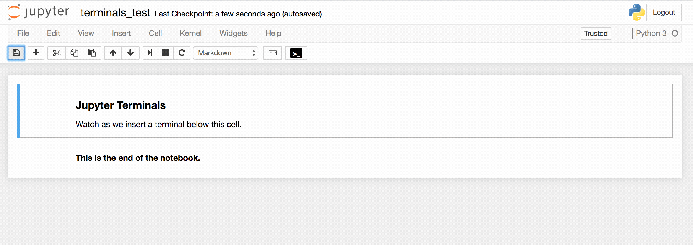
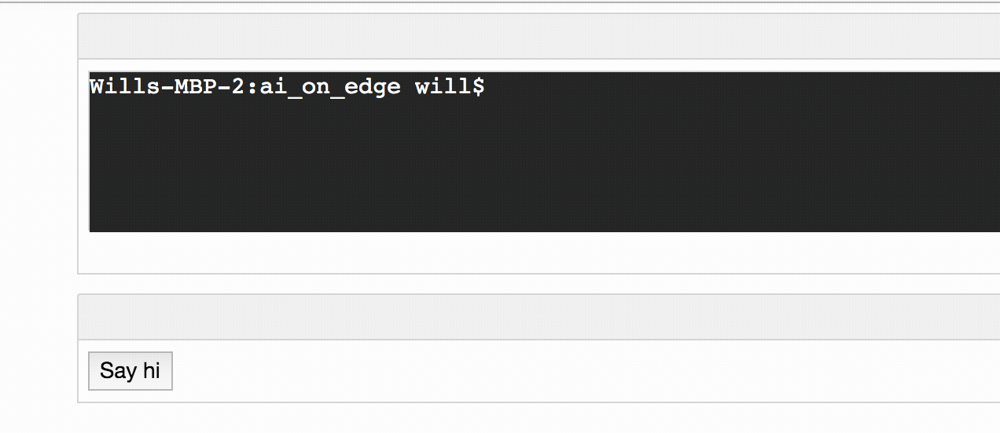

# Add Linux Terminals, Inline, in Jupyter Notebooks



### What's This Good For?

Using this plugin, you can insert terminal cells (shells) using a
button added to your Jupyter toolbar.  This is useful for teaching (We
use the facility at Udacity), or anywhere where you just want a
convenient interactive shell terminal inlined with the rest of your
Jupyter notebook cells. (Normally to access terminals in Jupyter, you
must leave your notebook).

### Features

* Any terminal cell can be "Reset" which destroys that shell and creates a new cell, via a link under the cell. (Use this if the terminal locks up somehow.)
* The shells `pwd` is set to the directory containing the current
notebook. If you click the "Jump to Notebook's Dir" link you can make the
terminal go back to the directory where the notebook is located.
* Remove Terminal cells by simply deleting them.
* Set the number of lines displayed in a terminal cell by editing the cell's metadata.
* Set an initial command to run when the terminal is first opened, also available in the cell's metadata.

[ _Please note: Each terminal cell is connected to a separate bash shell. You can see these terminals in Jupyter's "Running" tab.  If you reload the notebook, you will connect to the same Jupyter terminals you loaded earlier, with their history intact (although you may not see the previous output in that terminal).  If you delete a terminal cell, the Jupyter terminal will continue to live for the life of the server until you shut it down from the "Running" tab._]

To configure the terminal cell you can edit its metadata. It will look something like this:

```
{
  "terminalCellId": "id_5gnrnaq",
  "terminalConfig": {
    "initialCommand": "",
    "rows": 6,
    "startingDirectory": "samples/ai_on_edge",
    "terminalId": "id_j4fpm1t",
    "type": "terminal"
  }
}
```

* You can set the number of rows displayed for the terminal with the `rows` field. 
* You can set an initial command to run every time the terminal loads, with the `initialCommand` field. (Note that a carriage return will be added to this command automatically.)
* You can set the startingDirectory for this terminal, to something other than the one containing this notebook.
* Do not change the `terminalId` or `type` fields.

### Terminal Control Buttons



You can also add buttons to markdown cells that can send commands to
terminals. This may be useful when you're teaching a topic and want to
set up a button that enters a long or complex command you want
students to see demonstrated, for instance, a `gcc` command with a lot of arguments.

Just click the "Create Control Button" link under a
terminal.  This will add a button labeled "Terminal Button" to the
next cell below the Terminal cell, or will insert a new markdown cell
if the next cell is a code cell (or there is no next cell). By default 
the buttons will just run a simple Hello World message to the terminal.
To change the command that is run in the terminal, edit the metadata for
the cell containing the button. You will find metadata like the following:

```
{
  "terminalCellId": "id_dut2ahg",
  "terminalConfig": {
    "buttonsConfig": {
      "id_kk1vk6w": {
        "addCr": "true",
        "command": "echo \"Hello World!\"",
        "targetCellId": "id_38fegvu"
      }
    },
    "type": "markdown"
  }
}
```

Each button you create will have an entry in the metadata you can
modify to set the command the button runs in the terminal.  

* If `addCr` is true, then the plugin will also add a carriage return after the
command when it is sent to the terminal.  
* The `targetCellId` is the ID of the terminal that the button will send the command to. By default
this is the terminal you used to create the button in the first place.

If you want to create more than one button to control a terminal, you
can. Each will get a unique ID. To see the IDs for each button, you
can edit the markdown of the cell containing the button. Each button
is described by some HTML in the markdown cell, and the class attached
to the button will reveal to you its ID. For instance, for the button
shown above,

```
<button class="terminal-button-id_kk1vk6w">Button</button>
```

If you don't have the plugin installed, then terminal cells will
appear as markdown cells with an explanatory message on how to install
the plugin in them. When you distribute notebooks with Jupyter
Terminals, the recipient will also need to install the plugin to see
(and use) them.


### Installation

Install the plugin with :

`pip install jupyterterminals`

or

`conda install -c willkessler jupyterterminals`

### Limitations

This plugin has not been configured to work on Windows systems running Jupyter.
This is planned for a future release, however.

### TODOs

* Add a global metadata config so we can turn off the display of "Create Control Button" link.

### Related Software

Inlined Terminals are included by default in <a
style="font-weight:bold" target="_blank"
href="https://www.github.com/willkessler/jupytergraffiti">Jupyter
Graffiti</a>, which also allows you to add popup tips to any text in
your notebook, and create interactive screen recordings to help you
teach topics using Jupyter Notebooks.

Take a look at <a style="font-weight:bold" target="_blank"
href="https://www.github.com/willkessler/jupytergraffiti">Jupyter
Graffiti</a> to learn more about what it can do for you!

(Do not use Jupyter Terminals and Jupyter Graffiti at the same time: they will conflict.)
